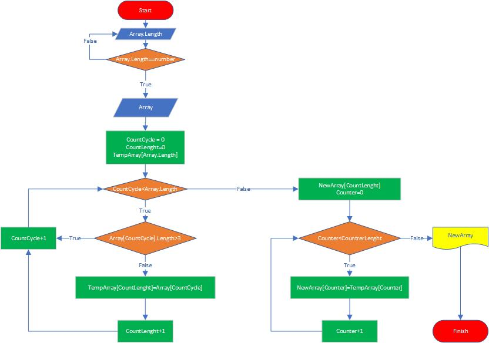

# **Итоговая контрольная работа по основному блоку**

## **Задача:**
Написать программу, которая из имеющегося массива строк формирует новый массив из строк, длина которых меньше, либо равна 3 символам. Первоначальный массив можно ввести с клавиатуры, либо задать на старте выполнения алгоритма. При решении не рекомендуется пользоваться коллекциями, лучше обойтись исключительно массивами.

## **Решение:**
Составлена блок-схема логики разрабатваемой программы<br>
    

Далее были описаны методы:<br>
- Проверки вводимых данных при запросе о количестве строк в массиве.
```C#
int CheckForNumber(int i = 5)
{
    Console.Write("Введите длинну массива: ");
    String lengts = Console.ReadLine();
    bool success = int.TryParse(lengts, out number);
    if (success)
    {
        return number;
    }
    else
    {
        if (i < 1)
        {
            Console.WriteLine($"Введено не числовое значение '{lengts ?? "<null>"}', ошибка ввода.");
            return number;
        }
        else
        {
            Console.WriteLine($"Введено не числовое значение '{lengts ?? "<null>"}', ошибка ввода. Осталось {i} попыток ввода.");
            return CheckForNumber(i - 1);
        }
    }
}
```
- Создания исходного массива.
```C#
string[] CreatArray(int length)
{
    string[] sourseArray = new string[length];
    for (int i = 0; i < length; i++)
    {
        Console.Write($"Осталось ввести {length - i} значений строк массива. \nВведите значение {i + 1} строки массива: ");
        sourseArray[i] = Console.ReadLine();
    }
    return sourseArray;
}
```
- Преобразования массива.
```C#
string[] ChangeArray(int newLength, out int countDataRecorder, string[] sourseArray)   
{
    string[] newArray = new string[newLength];
    int tempCount = 0;      
    for (int i = 0, j = 0; i < newLength; i++)
    {

        string temp = sourseArray[i];
        if (temp.Length <= 3)
        {
            newArray[j] = sourseArray[i];
            j++;
            tempCount = j;
        }
    }
    countDataRecorder = tempCount;
    return newArray;
}
```
- Печати массива.
```C#
void PrintArray(string[] sourseArray)           
{
    Console.Write($"{string.Join("; ", sourseArray)}\n");
}
```
Далее все методы были объединены в исходный код.